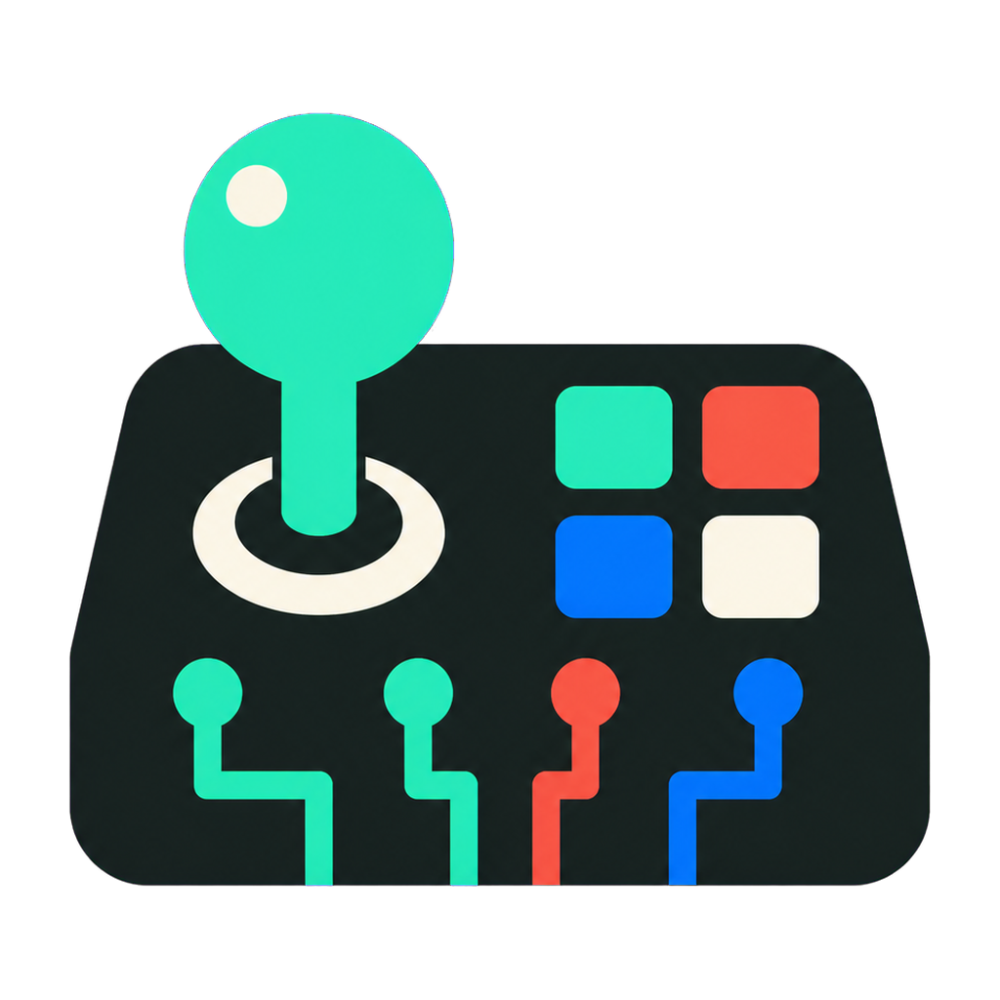

<p align="center">
  
</p>

# Fighting Game Stick

**Website:** [fightinggamestick.netlify.app](https://fightinggamestick.netlify.app)

**[Download the latest Windows installer](https://github.com/brandonhenry/FightingGameStick/releases/latest)** — open `FightingGameStickSetup.exe`, launch the app, and follow the driver prompt the first time.

The standalone [download page](download.html) provides direct installer and portable-build buttons.

Fighting Game Stick turns a physical keyboard into one persistent virtual Xbox 360 controller on Windows 10/11 x64. The app shows the same live report as an Xbox-style pad and an eight-button arcade stick, so a player can create a profile, click a controller control, press a keyboard key, and play an XInput-compatible game without per-game DLL injection.

The honest compatibility promise is **XInput games that do not deliberately block low-level keyboard hooks**. Anti-cheat systems, elevated games, keyboard hardware rollover limits, Steam Input, and games that ignore XInput can affect behavior. macOS builds run a focused-window UI/demo backend and do not create a system controller.

## What works

- One persistent ViGEm-backed Xbox 360 controller while the app is running.
- Global scan-code-based keyboard capture in a separate self-contained .NET 8 x64 process.
- Mapped-key blocking by default, with an optional keyboard pass-through switch.
- An unbindable `Ctrl + Alt + F12` emergency disable and matching tray action.
- Neutral SOCD cleaning, circular digital-stick diagonals, digital 0/100% triggers, repeat filtering, and shared-target reference behavior.
- One-key QCF (`↓ ↘ →`) and QCB (`↓ ↙ ←`) shortcuts for A, B, X, Y, LB, RB, LT, and RT, with a live step-by-step preview.
- Manual profile create, rename, duplicate, switch, delete, and atomic versioned persistence.
- Live keyboard rollover testing, gamepad/fight-stick views, driver/helper/player-slot status, logs, and repair actions.
- Safe neutral reset on pause, profile changes, suspend/lock, helper loss, explicit quit, and parent-pipe closure.

## Motion shortcuts

Open **Motion shortcuts**, choose a QCF or QCB attack, then press the keyboard key that should play it. A shortcut sends down, diagonal, and forward/back + attack as a short timed sequence through the same virtual controller. Normal held inputs remain active, auto-repeat does not restart the shortcut, and pausing or changing profiles immediately cancels the sequence and releases its outputs.

Motion shortcuts may be considered macros by a game, league, or tournament. Check the rules for where you play before using them competitively.

## Architecture

The renderer is a sandboxed React UI with no Node.js access. A context-isolated preload exposes only validated application actions. Electron owns profiles, tray behavior, lifecycle safety, and a newline-delimited JSON protocol to the Windows host. The native host owns the `WH_KEYBOARD_LL` hook and ViGEm client; its hook callback ignores injected input, decides suppression quickly, and queues report work off the hook thread.

Profile data is stored as `profiles.json` under Electron's platform user-data directory. Writes use a same-directory temporary file followed by an atomic rename. Malformed data is moved aside and replaced by the default fight layout.

## Development

Requirements: Node.js 24+, pnpm 11.9, and—only for building the Windows host—the .NET 8 SDK.

```powershell
pnpm install
pnpm lint
pnpm typecheck
pnpm test
pnpm start
```

On macOS, `pnpm start` opens demo mode. Input visualization and binding work while the app is focused; global capture, suppression, and virtual XInput output intentionally remain disabled.

## Make a Windows release

Run these commands on Windows 10/11 x64:

```powershell
pnpm install --frozen-lockfile
pnpm fetch:driver
pnpm build:host
pnpm make
```

`fetch:driver` downloads the official signed ViGEmBus 1.22.0 installer and verifies SHA-256 `89220a7865076b342892f98865f3499fb7c4cfd673159e89d352c360fd014c6a`. The app never installs it silently: onboarding opens the publisher's installer and the user approves UAC. Existing, stale, or conflicting drivers are reported for manual repair rather than removed.

Unsigned local application builds are expected. CI supports Authenticode when `WINDOWS_CERTIFICATE_BASE64` and `WINDOWS_CERTIFICATE_PASSWORD` secrets are configured. The ViGEmBus installer itself remains publisher-signed.

GitHub-hosted Windows runners use Windows Server, which ViGEmBus explicitly does not support. Hosted CI therefore compiles the native host and produces the installer on Windows, while the optional real `XInputGetState` probe targets a labeled self-hosted Windows 10/11 x64 runner with `ENABLE_WINDOWS_XINPUT_PROBE=true`.

## Troubleshooting

- **Game sees keyboard and controller actions:** leave Keyboard pass-through off. If Steam still duplicates/remaps output, disable Steam Input for that game.
- **Elevated game receives no input:** Windows integrity levels can block hooks from a non-elevated app. Run both at the same integrity level only if you trust the software involved.
- **A multi-key combo misses a key:** use the live simultaneous-key meter. This usually indicates keyboard matrix ghosting/rollover.
- **Wrong player slot:** disconnect other controllers or use Diagnostics → Open controller panel, then restart the game after Fighting Game Stick is ready.
- **Driver missing after installation:** restart Windows, recheck from Diagnostics, and use the official ViGEmBus repair installer. The app will not perform destructive driver cleanup.

ViGEmBus is retired, but its final signed open-source release remains the practical public XInput backend. Nefarius VirtualPad is a commercial successor and is not publicly downloadable. See the [ViGEmBus status](https://github.com/nefarius/ViGEmBus) and [VirtualPad availability](https://docs.nefarius.at/projects/VirtualPad/). Third-party license details are in [THIRD_PARTY_NOTICES.md](THIRD_PARTY_NOTICES.md).
